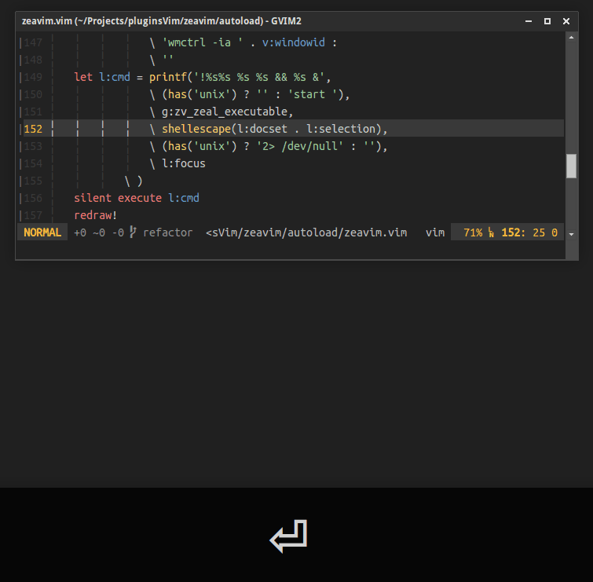
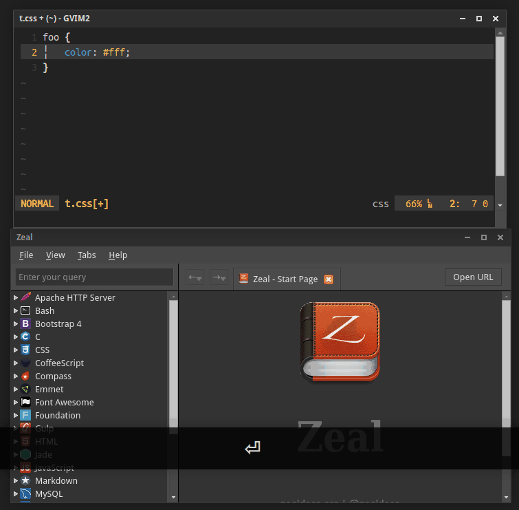

Zeavim, <small>Zeal for Vim</small>
===============================================================================================================================================


[Description](#description) | [Installation](#description) | [Usage](#usage) | [Mapping](#mapping) | [Commands](#commands) | [Customization](#customization) | [Notes](#notes)

Description <a id="description"></a>
-------------

Zeavim allows to use the offline documentation browser [Zeal](http://zealdocs.org) from Vim.



### Features

- Search for word under cursor, a motion or a visual selection.
- Search without losing focus from Vim if Zeal is already opened (Need wmctrl on UNIX).
- Possibility to specify dynamically a docset.
- Narrow search with a query.
- Allows using multiple docsets.
- Docset name completion.
- Define you own docsets using file types, extentions or regex.
- Supports docsets specific to file names (e.g `gulpfile.js`)
- Works on GNU/Linux and Windows.

*Starting from version `2.0.0` the plugin is following [semantic versionning 2.0.0](http://semver.org/).*

Installation <a id="installation"></a>
-------------

To use zeavim, you need of course to have Zeal installed. Grab it from [here](http://zealdocs.org/download.html) and install it .

### Manual installation

Install the distributed files into Vim runtime directory which is usually `~/.vim/`, or `$HOME/vimfiles` on Windows.

### Using a plugin manager

And this is the best way, use a vim plugin manager:

| Plugin manager                                         | In vimrc                         | Installation command |
|--------------------------------------------------------|----------------------------------|----------------------|
| [Vim-plug](https://github.com/junegunn/vim-plug)       | `Plug 'KabbAmine/zeavim.vim'`      | `PlugInstall`          |
| [Vundle](https://github.com/gmarik/Vundle.vim)         | `Plugin 'KabbAmine/zeavim.vim'`    | `PluginInstall`        |
| [NeoBundle](https://github.com/Shougo/neobundle.vim)   | `NeoBundle 'KabbAmine/zeavim.vim'` | `NeoBundleInstall`     |


Usage <a id="usage"></a>
-----

There are 3 ways of using zeavim:

1. `<leader>z`

	Search for word under cursor with the docset defined automatically<sup><a href="#plus">+</a></sup>.

2. `gz{motion}`

	Search for a motion with the docset defined automatically<sup><a href="#plus">+</a></sup>.

3. `<leader><leader>z`

	Narrow search with a docset<sup><a href="#plus">+</a></sup> and a query (A default docset is provided).
	
	
	
	- Multiple docsets can be defined, just separate them by a comma.
	- The docset name can be completed using `tab`, see [completion](#completion) for that.

Mapping <a id="mapping"></a>
-------

You can easily change the mapping keys of zeavim:

```vim
nmap gzz <Plug>Zeavim           " <leader>z (NORMAL mode)
vmap gzz <Plug>ZVVisSelection   " <leader>z (VISUAL mode)
nmap gz <Plug>ZVMotion         " gz{motion} (NORMAL mode)
nmap gZ <Plug>ZVKeyDocset      " <leader><leader>z
```

You can [disable the default mappings](#disableMappings), but this is useful only if you're not going to use all the `<Plug>`'s above.

Commands <a id="commands"></a>
-------

### Main commands

For those of you who prefer commands, here they are:

```vim
Zeavim    " NORMAL mode
ZvV       " VISUAL mode
ZvKD      " Type docset and query
```

### Specify manually a docset

If you need a lazy way to specify a docset, you can use:

```vim
Docset DOCSET_NAME
```

As an example, I'm working on a `scss` file but I want to get `compass` documentation when using Zeavim, so I just need to specify manually this docset:

```vim
Docset compass
```

Then Zeavim **only for the current buffer** will use `compass` as a docset.
Note that you can define multiple docsets here.

The docset name can be completed, for that see [completion](#completion).

To revert that and get zeavim working like usually, a simple `Docset` without argument is enough.



Customization <a id="customization"></a>
-------------

### Location of Zeal

By default zeavim looks for an executable named `zeal` on your PATH for UNIX and in `%ProgramFiles%/Zeal/zeal.exe` for Windows.
You can specify Zeal's location manually by adding in your vimrc:

```vim
let g:zv_zeal_executable = 'path/to/zeal'
```

Or if you're using both OS:

```vim
let g:zv_zeal_executable = has('win32') ?
			\ 'path/to/zeal.exe' :
			\ 'path/to/zeal'
```

### Add file types <a id="plus">+</a>

To define the docset, the plugin uses by order one of those:

* The value defined by `:Docset` command.
* The file name.
* The file extension.
* The file type.

If you need to add another file names, extensions or file types (Or overwrite those by default), you can use `g:zv_file_types` variable.

It's a dictionary where keys can be filename, file extension or file type and values are the docset names.

```vim
" For the docset, not mandatory but you can use underscores instead of spaces
let g:zv_file_types = {
    \	'FILE_NAME' : 'DOCSET_NAME',
    \	'EXTENSION' : 'DOCSET NAME',
    \	'FILE_TYPE' : 'DOCSET_NAME',
    \ }
```

Here again you can define multiple docsets for a type, just separate them by a comma.

```
'TYPE': 'DOCSET1,DOCSET2'
```

If a key starts with `^`, it will be considered as a regex. It is useful if you want to define many types to one docset (Note that the regex will use vim magic).

e.g

```vim
let g:zv_file_types = {
			\	'cpp'                   : 'c++',
			\	'^(G|g)runtfile\.'      : 'grunt',
			\	'^(G|g)ulpfile\.'       : 'gulp',
			\	'.htaccess'             : 'apache_http_server',
			\	'^(md|mdown|mkd|mkdn)$' : 'markdown',
			\	'css'                   : 'css,foundation,bootstrap_4',
			\ }
```

**N.B:** All the values above are already defined in the plugin, a part the `css` one.

### Disable default mappings <a id="disableMappings"></a>

You can disable the default mappings:

```vim
let g:zv_disable_mapping = 1
```

If you're using all the functionalities of the plugin (NORMAL, VISUAL, docset and query manual input), no need of setting this variable, just *map* the `<Plug>`'s normally.

### Docset name completion <a id="completion"></a>

When using `<leader><leader>z` or the command `Docset`, you can get a docset name completion with `Tab`.
The docset names are taken from your zeal's docset directory (The one specified in Zeal's options).

By default zeavim assumes that Zeal docsets are located in `%LOCALAPPDATA%\Local\Zeal\Zeal\docsets`, which expands into something like `C:\Users\you\AppData\Local\Zeal\Zeal\docsets` for Windows and `~/.local/share/Zeal/Zeal/docsets` for UNIX systems.

If you have them in a different folder, just set the correct path in `g:zv_docsets_dir` variable.

e.g

```vim
let g:zv_docsets_dir = has('win32') ?
			\ 'path/to/docsets/in/win' :
			\ 'path/to/docsets/in/unix'
```

My configuration
----------------

```vim
nmap gzz <Plug>Zeavim
vmap gzz <Plug>ZVVisSelection
nmap <leader>z <Plug>ZVKeyDocset
nmap gZ <Plug>ZVKeyDocset<CR>
nmap gz <Plug>ZVMotion
let g:zv_file_types = {
			\	'python'           : 'python 3',
			\	'javascript'       : 'javascript,nodejs',
			\	'^(G|g)ulpfile\.'  : 'gulp,javascript,nodejs',
			\	'help'             : 'vim'
			\ }
let g:zv_docsets_dir = g:hasUnix ?
			\ '~/Important!/docsets_Zeal/' :
			\ 'Z:/k-bag/Important!/docsets_Zeal/'
```

Notes <a id="notes"></a>
-----

Zeavim was my first vim plugin and it was created in the beginning for a personal use, so please feel free to report issues and submit PR. I usually answer in 1-2 days.

Thanks to [Jerzy Kozera](https://github.com/jkozera) for creating such wonderful open-source application.

Thanks to Bram Moolenaar for creating the best piece of software in the world :heart:

Thanks to you if you're using zeavim.
